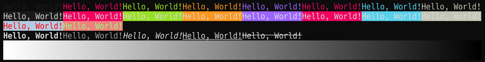

# v-color

A simple color library for V.



## Installation

```console
$ v install koki-develop.color
```

## Usage

```v
import koki_develop.color
```

### Ansi Color

```v
c := color.new('Hello, World!')

// Foreground
c.foreground(color.red).str() // => \x1b[31mHello, World!\x1b[0m

// Background
c.background(color.green).str() // => \x1b[42mHello, World!\x1b[0m

// Foreground and Background
c.foreground(color.red).background(color.green).str() // => \x1b[31m\x1b[42mHello, World!\x1b[0m

// You can also pass color name as string
c.foreground('red').background('green').str() // => \x1b[31m\x1b[42mHello, World!\x1b[0m

```
### RGB Color

```v
c := color.new('Hello, World!')

// Foreground
c.foreground(color.rgb(255, 0, 0)).str() // => \x1b[38;2;255;0;0mHello, World!\x1b[0m

// Background
c.background(color.rgb(0, 255, 0)).str() // => \x1b[48;2;0;255;0mHello, World!\x1b[0m

// Foreground and Background
c.foreground(color.rgb(255, 0, 0)).background(color.rgb(0, 255, 0)).str() // => \x1b[38;2;255;0;0m\x1b[48;2;0;255;0mHello, World!\x1b[0m

// You can also pass hex color code
c.foreground('#ff0000').background('#00ff00').str() // => \x1b[38;2;255;0;0m\x1b[48;2;0;255;0mHello, World!\x1b[0m
```

### Style

```v
c := color.new('Hello, World!')

c.bold().str()        // => \x1b[1mHello, World!\x1b[0m
c.dim().str()         // => \x1b[2mHello, World!\x1b[0m
c.italic().str()      // => \x1b[3mHello, World!\x1b[0m
c.underline().str()   // => \x1b[4mHello, World!\x1b[0m
c.blink().str()       // => \x1b[5mHello, World!\x1b[0m
c.rapid_blink().str() // => \x1b[6mHello, World!\x1b[0m
c.reverse().str()     // => \x1b[7mHello, World!\x1b[0m
c.hidden().str()      // => \x1b[8mHello, World!\x1b[0m

// You can chain styles
c.bold().italic().underline().str() // => \x1b[1m\x1b[3m\x1b[4mHello, World!\x1b[0m

// With color
c.foreground(color.red).bold().str() // => \x1b[31m\x1b[1mHello, World!\x1b[0m
```

## License

[MIT](./LICENSE)
